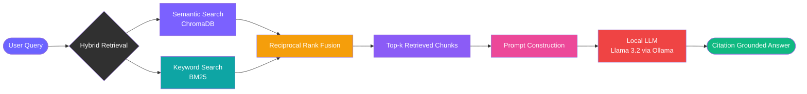

Users can query indexed knowledge using natural language while the retrieval engine automatically gathers relevant context before invoking the local LLM.

---

## Citation Grounding

Every generated answer is accompanied by citations pointing back to the exact document chunks used during generation.

This significantly improves transparency and reduces hallucinations.

---

## Performance Dashboard

Displays retrieval metrics including:

- Embedding Time
- Retrieval Time
- Generation Time
- Total Response Latency

---

# Architecture

RetrievalGPT follows a modular Retrieval-Augmented Generation (RAG) architecture inspired by production AI systems.

Rather than directly sending user questions to a language model, the application retrieves relevant information from indexed knowledge sources before generation. This retrieval-first design improves factual accuracy while ensuring every answer is grounded in evidence.

The pipeline consists of six primary stages:

1. User Query
2. Hybrid Retrieval
3. Reciprocal Rank Fusion
4. Context Assembly
5. Local LLM Inference
6. Citation-Grounded Response

---

## Retrieval Pipeline

---

## Document Ingestion Pipeline

Every supported data source follows a unified ingestion workflow.

