<div align="center">


<br>

<a href="#">

</a>

<br>


<br>

</div>

---

# Table of Contents

- [Overview](#overview)
- [Why RetrievalGPT](#why-retrievalgpt)
- [Core Features](#core-features)
- [Architecture](#architecture)
- [Screenshots](#screenshots)
- [Project Structure](#project-structure)
- [Technology Stack](#technology-stack)
- [Installation](#installation)
- [Usage](#usage)
- [Performance](#performance)
- [Feature Comparison](#feature-comparison)
- [Roadmap](#roadmap)
- [Skills Demonstrated](#skills-demonstrated)
- [License](#license)

---

# Overview

RetrievalGPT is a production-inspired **Retrieval-Augmented Generation (RAG)** system that enables users to interact with private knowledge sources using natural language while generating responses grounded in retrieved evidence.

Unlike conventional chatbot applications that rely solely on a language model's internal knowledge, RetrievalGPT retrieves relevant information from indexed documents before generating an answer. Every response is backed by citations, making outputs more trustworthy, explainable, and resistant to hallucinations.

Designed around enterprise AI engineering principles, the system combines semantic vector search with sparse keyword retrieval, fuses results using Reciprocal Rank Fusion (RRF), and generates grounded responses using a locally hosted Large Language Model through Ollama.

Supported knowledge sources include:

- PDF documents
- Markdown files
- Plain text files
- Pasted text
- Web URLs

Everything runs locally, ensuring complete privacy without relying on external APIs or cloud-hosted language models.

---

# Why RetrievalGPT?

Modern Large Language Models excel at language generation but struggle with factual accuracy when answering questions outside their training data. RetrievalGPT addresses this limitation by augmenting generation with context retrieved directly from user-provided documents.

The project demonstrates several production-level AI engineering practices commonly found in enterprise Retrieval-Augmented Generation systems:

- Hybrid Retrieval combining dense and sparse search
- Citation-grounded response generation
- Modular ingestion pipeline
- Persistent vector indexing
- Local LLM inference
- Offline-first deployment
- Evaluation-ready architecture
- Observability and performance tracking

Rather than serving as a simple chatbot, RetrievalGPT showcases how real-world AI assistants can retrieve, reason over, and cite domain-specific knowledge while maintaining transparency and reliability.

---

# Core Features

| Feature | Description |
|----------|-------------|
| PDF Upload | Upload and index PDF documents for semantic search |
| Markdown Upload | Retrieve information from Markdown knowledge bases |
| Plain Text Upload | Import raw text files into the retrieval pipeline |
| Paste Text | Instantly index manually pasted content |
| Web URL Ingestion | Retrieve and index content directly from websites |
| Intelligent Chunking | Automatically split large documents into optimized chunks |
| Embedding Generation | Generate semantic embeddings using Nomic Embed Text |
| ChromaDB Vector Search | Persistent vector database for dense retrieval |
| BM25 Keyword Search | Sparse lexical retrieval for exact keyword matching |
| Reciprocal Rank Fusion | Merge dense and sparse search results into a unified ranking |
| Local LLM Inference | Generate responses locally with Ollama and Llama 3.2 |
| Citation-Grounded Answers | Every answer includes supporting evidence from retrieved documents |
| Performance Metrics | Track latency, retrieval time, and response generation |
| Evaluation Pipeline | Measure retrieval quality and system performance |
| Observability | Monitor pipeline execution and retrieval behavior |
| Modern Streamlit UI | Interactive interface for document management and querying |
| Privacy Friendly | No external API calls or cloud dependencies |
| Fully Offline | Complete end-to-end local execution |

---

# Screenshots

The following screenshots showcase the core functionality and user interface of RetrievalGPT.

---

##  Application Dashboard

<p align="center">
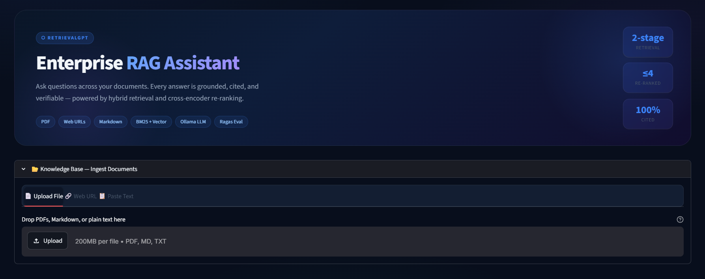
</p>

Displays the primary workspace where users can upload knowledge sources, configure retrieval settings, and interact with the local language model.

---

##  Document Upload

<p align="center">
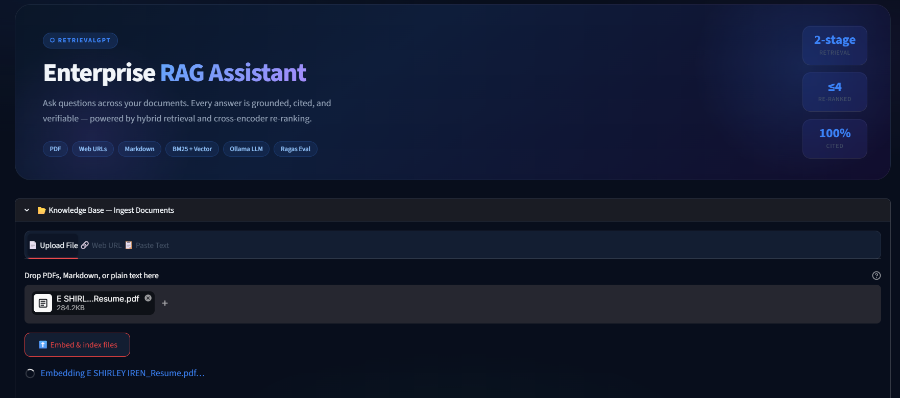
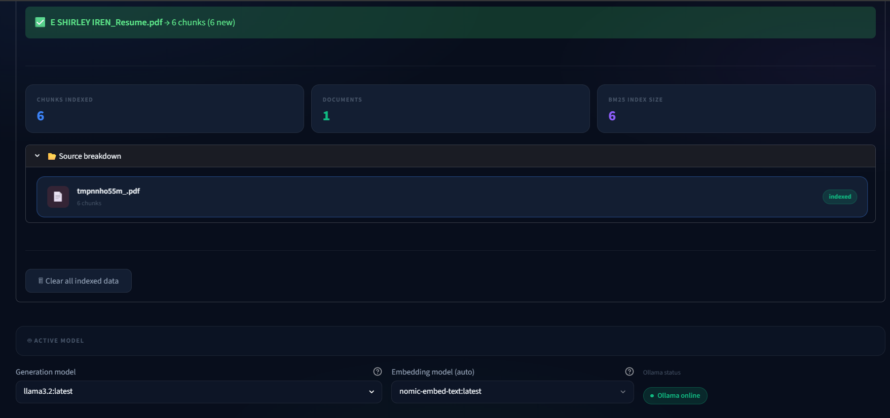
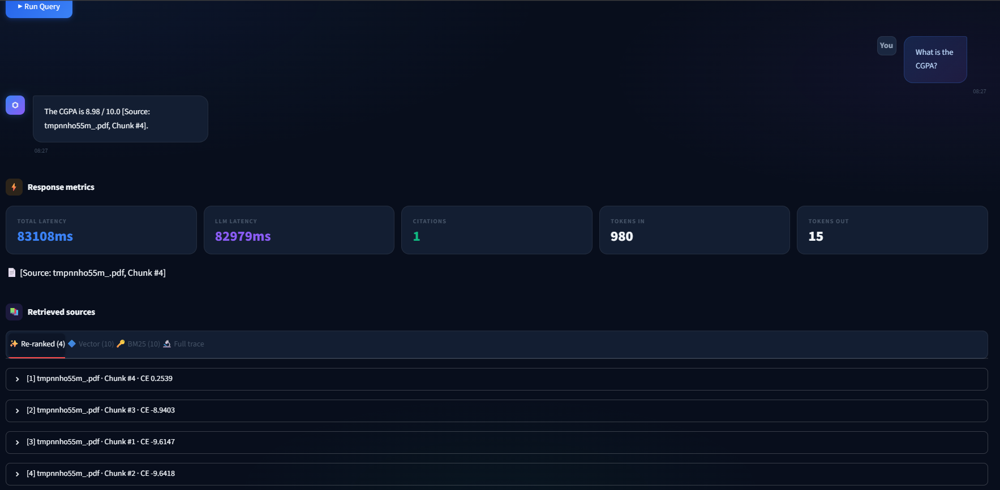
</p>

Supports ingestion of:

- PDF Documents
- Markdown Files
- Plain Text Files

Uploaded documents are automatically processed, chunked, embedded, and indexed.

---

## Web URL Ingestion

<p align="center">
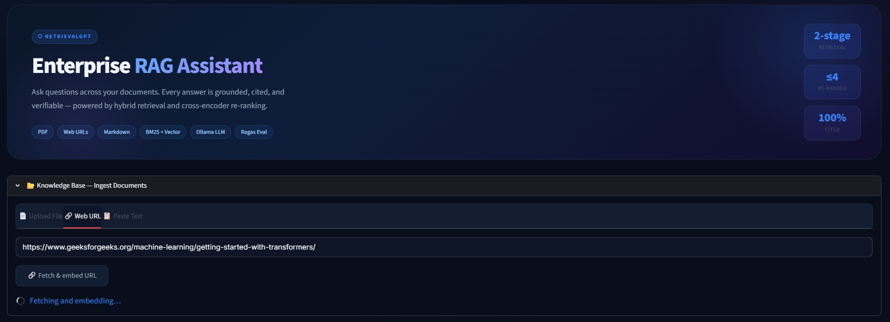
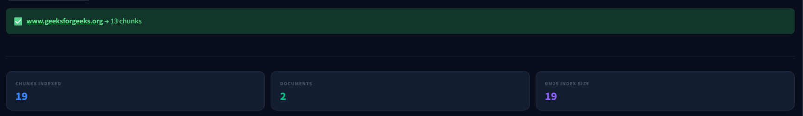
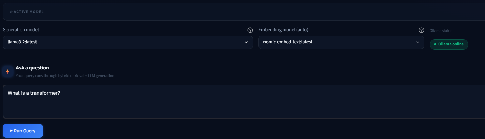
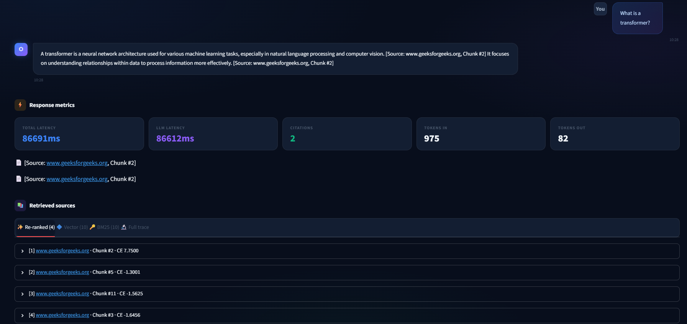
</p>

Import online content directly from web pages.

The ingestion pipeline automatically:

- Downloads webpage content
- Extracts readable text
- Cleans HTML
- Generates embeddings
- Stores vectors inside ChromaDB

---

##  Paste Text

<p align="center">
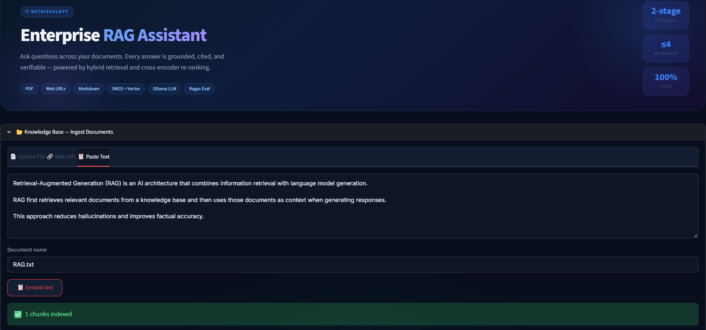
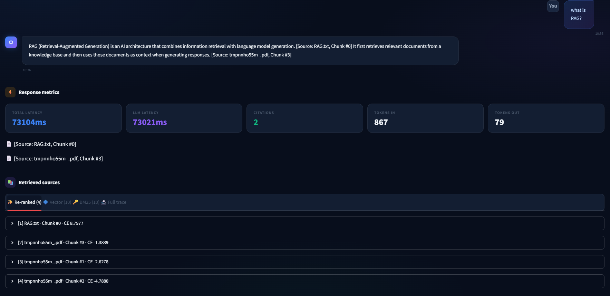
</p>

Quickly build a knowledge base without uploading files by directly pasting raw text into the application.

---

##  Question Answering

<p align="center">
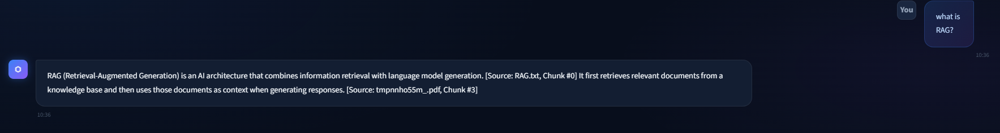
</p>

Users can query indexed knowledge using natural language while the retrieval engine automatically gathers relevant context before invoking the local LLM.

---

## 📚 Citation Grounding
## Citation Grounding

<p align="center">
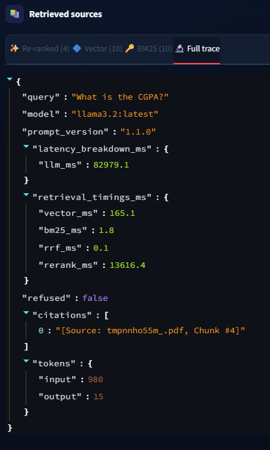
</p>

Every generated answer is accompanied by citations pointing back to the exact document chunks used during generation.

This significantly improves transparency and reduces hallucinations.

---
# Architecture

RetrievalGPT follows a modular Retrieval-Augmented Generation (RAG) architecture inspired by production AI systems.

Rather than directly sending user questions to a language model, the application retrieves relevant information from indexed knowledge sources before generation. This retrieval-first design improves factual accuracy while ensuring every answer is grounded in evidence.

The pipeline consists of six primary stages:

1. User Query
2. Hybrid Retrieval
3. Reciprocal Rank Fusion
4. Context Assembly
5. Local LLM Inference
6. Citation-Grounded Response

---

## Retrieval Pipeline


---

## Document Ingestion Pipeline

Every supported data source follows a unified ingestion workflow.

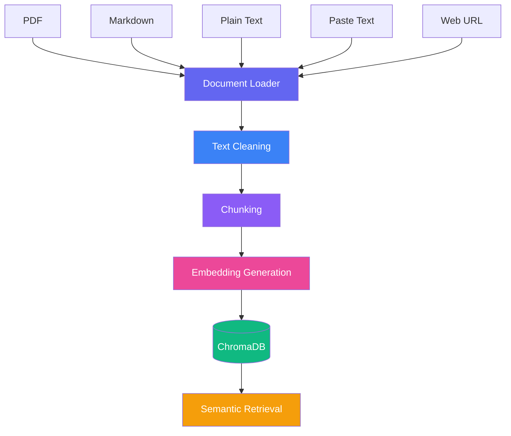

---

# Retrieval Workflow

```text
                    User Question
                          │
                          ▼
                 Hybrid Retrieval Engine
                 ┌─────────────────────┐
                 │                     │
                 ▼                     ▼
      ChromaDB Vector Search      BM25 Search
                 │                     │
                 └──────────┬──────────┘
                            ▼
               Reciprocal Rank Fusion
                            │
                            ▼
                  Top-k Ranked Chunks
                            │
                            ▼
                 Prompt Construction
                            │
                            ▼
               Local LLM (Llama 3.2)
                            │
                            ▼
          Citation-Grounded Response
```

---

# Project Structure

```text
RetrievalGPT/
│
├── app.py                         # Streamlit entry point
│
├── config/
│   ├── config.yaml
│   └── prompts.yaml
│
├── data/
│   ├── documents/
│   ├── uploads/
│   └── processed/
│
├── ingest/
│   ├── pdf_loader.py
│   ├── markdown_loader.py
│   ├── text_loader.py
│   ├── url_loader.py
│   ├── chunker.py
│   └── embedding_pipeline.py
│
├── retrieval/
│   ├── chroma_store.py
│   ├── bm25.py
│   ├── hybrid_search.py
│   ├── reciprocal_rank_fusion.py
│   └── retriever.py
│
├── llm/
│   ├── ollama_client.py
│   ├── prompt_builder.py
│   └── generator.py
│
├── evaluation/
│   ├── metrics.py
│   ├── benchmark.py
│   └── evaluation_pipeline.py
│
├── ui/
│   ├── dashboard.py
│   ├── sidebar.py
│   └── components.py
│
├── utils/
│   ├── logger.py
│   ├── helpers.py
│   └── constants.py
│
├── chroma_db/
│
├── assets/
│   └── screenshots/
│
├── requirements.txt
├── README.md
└── LICENSE
```

---

> **Architecture Philosophy**

# Technology Stack

RetrievalGPT combines modern open-source AI tooling with a modular architecture to build an enterprise-inspired Retrieval-Augmented Generation (RAG) pipeline.

| Category | Technology | Purpose |
|-----------|------------|---------|
| Programming Language | Python | Core application development |
| User Interface | Streamlit | Interactive web application |
| LLM Runtime | Ollama | Local model inference |
| Language Model | Llama 3.2 | Response generation |
| Embedding Model | Nomic Embed Text | Dense semantic embeddings |
| Vector Database | ChromaDB | Persistent vector storage |
| Keyword Retrieval | BM25 / Rank-BM25 | Sparse lexical search |
| Retrieval Strategy | Hybrid Search | Dense + Sparse retrieval |
| Rank Fusion | Reciprocal Rank Fusion (RRF) | Combines retrieval scores |
| Framework | LangChain | Pipeline orchestration |
| PDF Processing | PyPDF | Document extraction |
| Web Scraping | BeautifulSoup | Website ingestion |
| Configuration | YAML | Centralized application configuration |
| Metadata Storage | SQLite | Local persistence |
| Version Control | Git | Source code management |
| Repository Hosting | GitHub | Collaboration & versioning |

---

# Installation

## Prerequisites

Before installing RetrievalGPT, ensure the following software is available on your machine.

| Requirement | Version |
|-------------|---------|
| Python | 3.10+ |
| Git | Latest |
| Ollama | Latest |
| Operating System | Windows, Linux, macOS |

---

## 1. Clone the Repository

```bash
git clone https://github.com/yourusername/RetrievalGPT.git

cd RetrievalGPT
```

---

## 2. Create a Virtual Environment

### Windows

```powershell
python -m venv .venv

.venv\Scripts\activate
```

### Linux / macOS

```bash
python3 -m venv .venv

source .venv/bin/activate
```

---

## 3. Install Dependencies

```bash
pip install --upgrade pip

pip install -r requirements.txt
```

---

## 4. Install Ollama

Download Ollama from:

https://ollama.com

Verify installation:

```bash
ollama --version
```

---

## 5. Download Required Models

### Llama 3.2

```bash
ollama pull llama3.2
```

### Nomic Embed Text

```bash
ollama pull nomic-embed-text
```

Verify installed models:

```bash
ollama list
```

Expected output:

```text
llama3.2

nomic-embed-text
```

---

# Configuration

Application settings can be customized through the configuration files.

```text
config/

├── config.yaml

└── prompts.yaml
```

Typical configurable parameters include:

- Chunk Size
- Chunk Overlap
- Embedding Model
- Retrieval Top-k
- LLM Temperature
- Maximum Tokens
- Database Location
- Logging Level

---

## Example Configuration

```yaml
embedding_model: nomic-embed-text

llm_model: llama3.2

chunk_size: 600

chunk_overlap: 100

top_k: 5

temperature: 0.2

vector_database: chromadb
```

---

# Running the Application

Start the Streamlit server.

```bash
streamlit run app.py
```

The application will be available at

```text
http://localhost:8501
```

---

# First-Time Setup Workflow

When RetrievalGPT is launched for the first time, the recommended workflow is:

```text
Launch Application

↓

Upload Documents

↓

Document Parsing

↓

Chunk Generation

↓

Embedding Creation

↓

Vector Index Construction

↓

Ready for Question Answering
```

---

# Supported Knowledge Sources

RetrievalGPT can ingest information from multiple sources.

| Source | Supported |
|----------|-----------|
| PDF | ✅ |
| Markdown | ✅ |
| Plain Text | ✅ |
| Pasted Text | ✅ |
| Web URLs | ✅ |

---

# Supported Retrieval Pipeline

The retrieval engine combines multiple search techniques.

| Component | Implementation |
|------------|----------------|
| Dense Search | ChromaDB |
| Sparse Search | BM25 |
| Rank Fusion | Reciprocal Rank Fusion |
| Context Selection | Top-k Ranking |
| Response Generation | Ollama + Llama 3.2 |
| Citation Grounding | Included |

---

# Runtime Pipeline

```text
User Query

↓

Generate Query Embedding

↓

Semantic Search

+

Keyword Search

↓

Reciprocal Rank Fusion

↓

Top-k Document Selection

↓

Prompt Construction

↓

Local LLM

↓

Citation Grounded Answer
```

---

# Local Inference

Unlike cloud-based AI assistants, RetrievalGPT performs inference entirely on the local machine.

Advantages include:

- No API costs
- No internet dependency
- Complete privacy
- Faster document access
- Offline availability
- Enterprise-friendly deployment
- Full ownership of data

---

# Project Design Principles

RetrievalGPT is built around several engineering principles that improve maintainability and scalability.

### Modular Design

Each subsystem performs a single responsibility, allowing components to evolve independently.

### Retrieval Before Generation

The language model only receives relevant retrieved context, reducing hallucinations and improving factual accuracy.

### Local First

All inference, indexing, and retrieval occur on-device without transmitting sensitive data externally.

### Explainability

Every response is accompanied by citations, enabling users to trace generated content back to its original source.

### Extensibility

Embedding models, vector databases, retrievers, and language models can be replaced with minimal code changes.

---

# Usage

RetrievalGPT is designed to provide a streamlined workflow for building and querying private knowledge bases. Whether the source is a PDF, Markdown file, website, or raw text, the application automatically processes, indexes, and retrieves relevant information before generating a citation-grounded response.

---

# Typical Workflow

```text
Launch Application
        │
        ▼
Upload Knowledge Sources
        │
        ▼
Document Parsing
        │
        ▼
Text Chunking
        │
        ▼
Embedding Generation
        │
        ▼
Vector Database Indexing
        │
        ▼
Ask Questions
        │
        ▼
Hybrid Retrieval
        │
        ▼
Citation-Grounded Answer
```

---

# Uploading Documents

RetrievalGPT supports multiple document formats for knowledge ingestion.

| Source | Supported |
|----------|-----------|
| PDF | ✅ |
| Markdown | ✅ |
| Plain Text | ✅ |
| Web URLs | ✅ |
| Pasted Text | ✅ |

After uploading, the application automatically:

- Parses the content
- Cleans extracted text
- Splits documents into chunks
- Generates semantic embeddings
- Stores vectors inside ChromaDB
- Builds the BM25 keyword index

No manual preprocessing is required.

---

## Uploading PDF Documents

Click **Upload Document** and select one or more PDF files.

The ingestion pipeline automatically performs:

```text
PDF

↓

Text Extraction

↓

Cleaning

↓

Chunking

↓

Embedding Generation

↓

Vector Indexing

↓

Ready for Retrieval
```

Ideal for:

- Research Papers
- Documentation
- Technical Manuals
- Books
- Company Knowledge Bases

---

## Uploading Markdown Files

Markdown documents preserve structure while enabling semantic retrieval.

Perfect for:

- README files
- Wikis
- Documentation
- Developer Notes
- Internal Knowledge Bases

---

## Uploading Plain Text

Raw text files can be indexed immediately without additional formatting.

Common use cases:

- Meeting Notes
- Reports
- Logs
- Specifications
- Notes

---

# Web URL Ingestion

Instead of uploading files, RetrievalGPT can retrieve information directly from web pages.

Supported workflow:

```text
Paste URL

↓

Download HTML

↓

Remove HTML Tags

↓

Extract Text

↓

Chunk Content

↓

Generate Embeddings

↓

Store in ChromaDB
```

This makes it easy to build searchable knowledge bases from:

- Documentation websites
- Blogs
- Knowledge portals
- API references
- Product documentation

---

# Paste Text

For quick experimentation, users can paste raw text directly into the application.

Example:

```text
Paste documentation

↓

Click Process

↓

Chunks Generated

↓

Embeddings Created

↓

Ready for Question Answering
```

Useful for:

- Interview preparation
- Lecture notes
- Meeting summaries
- Research snippets
- Temporary knowledge

---

# Asking Questions

Once documents have been indexed, users can interact with the knowledge base using natural language.

Example Questions

```text
Summarize this document.

Explain Reciprocal Rank Fusion.

What are the installation steps?

How does the retrieval pipeline work?

List the supported file formats.

What models are used?
```

The retrieval engine automatically determines the most relevant document chunks before invoking the language model.

---

# Hybrid Retrieval

Every question triggers both retrieval mechanisms simultaneously.
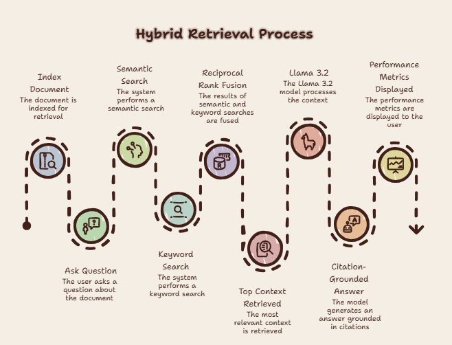

<This approach combines:

- Semantic similarity
- Exact keyword matching
- Improved recall
- Better ranking quality

---

# Citation-Grounded Responses

Unlike conventional chatbots, RetrievalGPT always provides supporting evidence.

Example

```text
Question

What is Reciprocal Rank Fusion?

↓

Answer

Reciprocal Rank Fusion combines rankings from multiple retrieval
systems into a single unified ranking, improving recall and retrieval
quality.

Sources

Page 7
Chunk 14

Page 8
Chunk 16
```

Benefits:

- Improved trust
- Reduced hallucinations
- Transparent reasoning
- Easy verification

---

# Example End-to-End Query

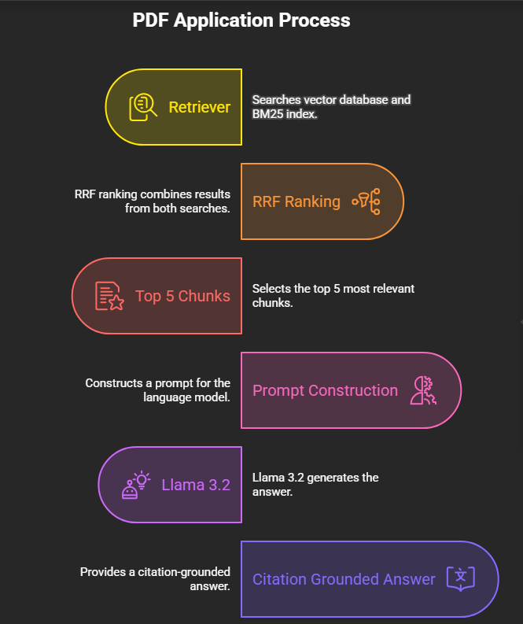
---


# Performance Dashboard

The dashboard provides visibility into the retrieval pipeline, making debugging and optimization significantly easier.

Displayed information includes:

- Number of indexed documents
- Number of generated chunks
- Vector database size
- Retrieved context
- Top-k documents
- Retrieval latency
- Generation latency
- Total query time

---

# Observability

The retrieval workflow is intentionally transparent.

Users can inspect:

- Retrieved chunks
- Chunk similarity scores
- Keyword matches
- Final fused rankings
- Prompt sent to the LLM
- Source citations

This makes RetrievalGPT significantly easier to debug than black-box chatbot applications.

---

# Example Session

```text
Upload PDF

↓

Index Document

↓

Ask:

"What is Hybrid Retrieval?"

↓

Semantic Search

↓

Keyword Search

↓

Reciprocal Rank Fusion

↓

Top Context Retrieved

↓

Llama 3.2

↓

Citation-Grounded Answer

↓

Performance Metrics Displayed
```

---

# Performance

RetrievalGPT is designed with an emphasis on retrieval quality, transparency, and local inference performance. Rather than optimizing solely for language model generation, the system measures the performance of every stage in the Retrieval-Augmented Generation pipeline.

---

# Benchmark Configuration

The following benchmark represents the default configuration used during development.

| Component | Configuration |
|-----------|---------------|
| Language Model | Llama 3.2 |
| LLM Runtime | Ollama |
| Embedding Model | Nomic Embed Text |
| Vector Database | ChromaDB |
| Keyword Retrieval | BM25 |
| Fusion Algorithm | Reciprocal Rank Fusion |
| Chunk Size | 600 Tokens |
| Chunk Overlap | 100 Tokens |
| Retrieval Strategy | Hybrid |
| Citation Grounding | Enabled |
| Offline Execution | Yes |

---

# Typical Latency

Actual latency depends on hardware specifications, document size, and the selected language model.

| Pipeline Stage | Typical Latency |
|----------------|----------------:|
| Document Parsing | 40–180 ms |
| Chunk Generation | 20–60 ms |
| Embedding Generation | 80–300 ms |
| ChromaDB Retrieval | 10–40 ms |
| BM25 Retrieval | 5–20 ms |
| Reciprocal Rank Fusion | <5 ms |
| Prompt Construction | 5–20 ms |
| LLM Generation | 1–4 s |
| Total Query Time | 1.2–4.5 s |

---

# Example Benchmark

```text
Knowledge Sources        8 Documents

Total Chunks             412

Embedding Model          nomic-embed-text

Vector Search             29 ms

BM25 Search               11 ms

RRF Fusion                 3 ms

Prompt Construction        9 ms

LLM Generation          1562 ms

──────────────────────────────────

Total Response         1614 ms
```

---

# Retrieval Quality

Retrieval quality is improved by combining complementary search techniques.

| Retrieval Method | Strength |
|------------------|----------|
| Semantic Search | Understands contextual meaning |
| BM25 | Matches exact keywords |
| Reciprocal Rank Fusion | Improves ranking robustness |
| Top-k Context Selection | Reduces prompt noise |
| Citation Grounding | Improves answer reliability |

---

# Why Hybrid Retrieval?

Enterprise Retrieval-Augmented Generation systems rarely depend on vector search alone.

Dense retrieval excels at understanding semantic similarity, while sparse retrieval performs better when queries contain exact terminology, identifiers, filenames, or technical vocabulary.

RetrievalGPT combines both approaches to increase recall and reduce the likelihood of missing relevant information.

---

## Dense Retrieval

Powered by ChromaDB and dense embeddings.

Best suited for:

- Semantic similarity
- Natural language questions
- Concept matching
- Synonyms
- Related terminology

Example

```text
Question

How does the application understand documents?

Retrieved

Embedding Generation

Semantic Search

Vector Database

Context Retrieval
```

---

## Sparse Retrieval

Powered by BM25.

Best suited for:

- Function names
- API names
- Version numbers
- File names
- Exact technical terminology

Example

```text
Question

Where is reciprocal_rank_fusion.py used?

Retrieved

retrieval/

reciprocal_rank_fusion.py
```

---

# Reciprocal Rank Fusion

RetrievalGPT combines both ranked result sets using Reciprocal Rank Fusion (RRF).

Instead of trusting one retrieval method exclusively, RRF rewards documents that appear near the top of multiple rankings.

Benefits include:

- Better recall
- More stable rankings
- Reduced retrieval bias
- Improved robustness
- Strong performance across different document types

---

## Fusion Workflow

```text
Semantic Search
        │
        ▼
Ranked Results

        +

BM25 Search
        │
        ▼
Ranked Results

        │
        ▼

Reciprocal Rank Fusion

        │
        ▼

Unified Ranking

        │
        ▼

Top-k Context
```

---

# Evaluation Pipeline

RetrievalGPT is structured so retrieval quality can be evaluated independently of language generation.

Evaluation stages include:

- Document ingestion
- Chunk generation
- Embedding quality
- Retrieval accuracy
- Context relevance
- Citation correctness
- Response quality
- Overall latency

This separation allows retrieval improvements without modifying the language model.

---

# Observability

Modern AI systems require visibility into every stage of execution.

RetrievalGPT exposes information such as:

- Retrieved chunks
- Similarity scores
- BM25 rankings
- Final RRF ranking
- Prompt context
- Generation latency
- Total response time

These metrics simplify debugging and performance optimization.

---

# Feature Comparison

| Capability | Traditional Chatbot | RetrievalGPT |
|------------|--------------------|--------------|
| Uses Private Documents | ❌ | ✅ |
| Semantic Search | ❌ | ✅ |
| Keyword Search | ❌ | ✅ |
| Hybrid Retrieval | ❌ | ✅ |
| Citation Support | ❌ | ✅ |
| Hallucination Resistant | Limited | ✅ |
| Local Inference | Usually No | ✅ |
| Offline Operation | ❌ | ✅ |
| Explainable Responses | ❌ | ✅ |
| Modular Retrieval Pipeline | ❌ | ✅ |
| Enterprise Deployment | Limited | ✅ |

---

# Enterprise Engineering Practices

RetrievalGPT demonstrates several engineering concepts commonly found in production AI systems.

| Engineering Practice | Included |
|----------------------|----------|
| Modular Architecture | ✅ |
| Retrieval-Augmented Generation | ✅ |
| Hybrid Search | ✅ |
| Vector Database | ✅ |
| Sparse Retrieval | ✅ |
| Rank Fusion | ✅ |
| Local Model Inference | ✅ |
| Configuration Management | ✅ |
| Performance Monitoring | ✅ |
| Citation Grounding | ✅ |
| Offline Deployment | ✅ |

---
# Roadmap

RetrievalGPT is designed as a foundation for experimentation with modern Retrieval-Augmented Generation systems. The roadmap below outlines planned enhancements that extend the platform toward enterprise AI assistant capabilities.

| Status | Feature | Description |
|---------|---------|-------------|
| ✅ | Hybrid Retrieval | Dense + Sparse Retrieval |
| ✅ | Citation Grounding | Source-backed responses |
| ✅ | Local LLM Inference | Ollama Integration |
| ✅ | ChromaDB Integration | Persistent Vector Storage |
| ✅ | BM25 Search | Sparse Retrieval |
| ✅ | Reciprocal Rank Fusion | Hybrid Ranking |
| ✅ | Multi-format Document Support | PDF, Markdown, Text, URLs |
| 🚧 | Conversation Memory | Multi-turn contextual conversations |
| 🚧 | Streaming Responses | Token-by-token answer generation |
| 🚧 | OCR Support | Extract text from scanned PDFs and images |
| 🚧 | Image Retrieval | Retrieve and reason over image embeddings |
| 🚧 | Metadata Filtering | Filter documents using metadata |
| 🚧 | REST API | Programmatic access |
| 🚧 | Docker Support | Containerized deployment |
| 🚧 | Authentication | User login and authorization |
| 🚧 | GPU Optimization | Faster embedding and inference |
| 🚧 | Knowledge Graph Integration | Entity-aware retrieval |
| 🚧 | Agentic RAG | Multi-step reasoning agents |
| 🚧 | Cloud Deployment | AWS / Azure / GCP support |

---

# Future Enhancements

Several advanced capabilities are planned to further improve RetrievalGPT.

###  Long-Term Conversation Memory

Maintain context across multiple user interactions to enable conversational knowledge retrieval.

---

###  OCR Pipeline

Automatically extract text from scanned PDFs and images before indexing.

Potential integrations:

- EasyOCR
- PaddleOCR
- Tesseract

---

###  Image Retrieval

Support multimodal Retrieval-Augmented Generation by indexing image embeddings alongside text.

Potential capabilities include:

- Screenshot search
- Diagram retrieval
- Technical drawing search
- Image caption retrieval

---

###  Agentic RAG

Enable autonomous multi-step workflows.

Example:

```text
Question

↓

Search Documents

↓

Determine Missing Information

↓

Perform Additional Retrieval

↓

Reason

↓

Generate Final Answer
```

---

###  REST API

Expose RetrievalGPT through REST endpoints for integration with external applications.

Example endpoints:

```text
POST /upload

POST /query

GET /documents

DELETE /document

GET /metrics
```

---

###  Docker Deployment

Simplify deployment through containerized infrastructure.

Example

```bash
docker compose up --build
```

---

###  Cloud Deployment

Future deployment targets include:

- AWS
- Azure
- Google Cloud
- DigitalOcean
- Railway
- Render

---

# Skills Demonstrated

RetrievalGPT demonstrates practical implementation of modern AI engineering concepts frequently used in production Retrieval-Augmented Generation systems.

## Artificial Intelligence

- Retrieval-Augmented Generation (RAG)
- Large Language Models (LLMs)
- Prompt Engineering
- Context Augmentation
- Local AI Inference
- AI System Design

---

## Information Retrieval

- Hybrid Retrieval
- Semantic Search
- Sparse Retrieval
- Dense Retrieval
- Reciprocal Rank Fusion
- Top-k Ranking
- Vector Search
- Citation Grounding

---

## Machine Learning Infrastructure

- Embedding Models
- Vector Databases
- ChromaDB
- BM25
- LangChain
- Ollama

---

## Software Engineering

- Modular Architecture
- Configuration Management
- Performance Optimization
- Logging
- Evaluation Pipelines
- Observability
- Offline Deployment
- Python Development

---

## Tools & Technologies

- Python
- Streamlit
- Ollama
- Llama 3.2
- Nomic Embed Text
- ChromaDB
- LangChain
- Rank-BM25
- BeautifulSoup
- PyPDF
- SQLite
- YAML
- Git
- GitHub

---

# Project Highlights

RetrievalGPT demonstrates several production-inspired AI engineering principles.

✅ Hybrid Retrieval

✅ Citation-Grounded Responses

✅ Local Language Model Inference

✅ Modular Architecture

✅ Explainable AI

✅ Offline Deployment

✅ Evaluation-Ready Pipeline

✅ Configurable Components

✅ Privacy-Preserving Design

✅ Enterprise-Inspired Workflow

---

# Contributing

Contributions are welcome.

If you would like to improve RetrievalGPT, feel free to:

- Report bugs
- Suggest new features
- Improve documentation
- Optimize retrieval performance
- Add evaluation benchmarks
- Enhance the user interface
- Improve code quality

## Contribution Workflow

```text
Fork Repository

↓

Create Feature Branch

↓

Implement Changes

↓

Commit Changes

↓

Push Branch

↓

Open Pull Request
```

---

# License

This project is released under the **MIT License**.

You are free to:

- Use
- Modify
- Distribute
- Fork

Please refer to the `LICENSE` file for complete details.

---

# Acknowledgements

RetrievalGPT builds upon several outstanding open-source technologies.

Special thanks to the communities behind:

- Ollama
- LangChain
- ChromaDB
- Streamlit
- Python
- BeautifulSoup
- Rank-BM25
- PyPDF
- Nomic AI
- Meta Llama

Without these projects, modern local AI development would not be possible.

---

# Repository Statistics

| Category | Value |
|-----------|-------|
| Programming Language | Python |
| User Interface | Streamlit |
| Language Model | Llama 3.2 |
| Embedding Model | Nomic Embed Text |
| Vector Database | ChromaDB |
| Retrieval Strategy | Hybrid |
| Keyword Search | BM25 |
| Rank Fusion | Reciprocal Rank Fusion |
| Citation Support | ✅ |
| Offline Execution | ✅ |
| Privacy Friendly | ✅ |
| Multi-source Ingestion | ✅ |

---

# Support

If you found this repository useful:

⭐ Star the repository

🐛 Report issues

💡 Suggest improvements

🤝 Contribute new features

---

<div align="center">


Built to explore modern AI engineering practices through modular Retrieval-Augmented Generation pipelines, local language model inference, hybrid retrieval strategies, and explainable AI.

<br>

**If this project helped you, consider giving it a ⭐ on GitHub.**

<br>


</div>
